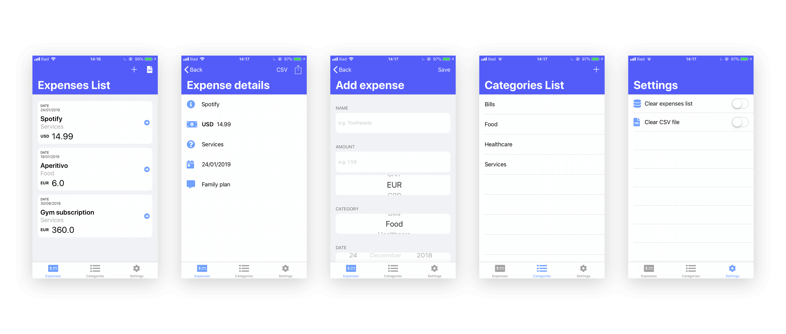

<h1 align="center">Dinero 💶</h1>

Dinero is a simple expenses tracker for iOS made for a University course.

  

## Main features
* Keep track of user expenses
* Let user add and manage categories
* Store data in a SQLite database
* Import/Export from a CSV file created in the app's document directory. I know this kind of implementation doesn't make a lot of sense but CSV was a requirement and this was the easiest way to do it 🤷🏻‍‍

## Extra features
This is a list of features not required but that I added for a better UX. You have the ability to:
* edit expenses
* share expenses
* clear the expenses list
* clear the CSV file

## Credits
[FontAwesome Free](https://fontawesome.com/license/free) was used as main resources for every UI's icon. Thank you guys, ❤️ ya!
